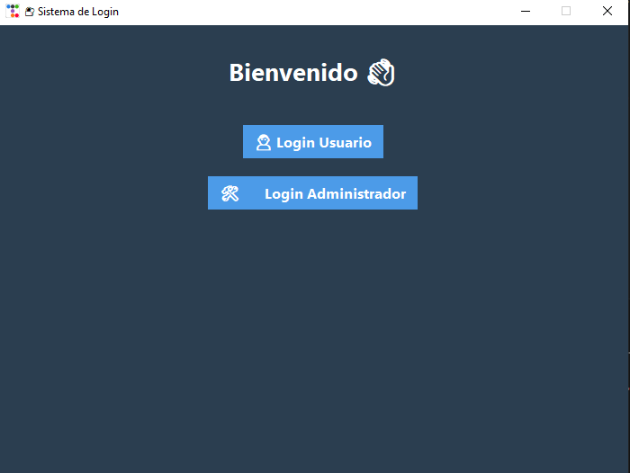
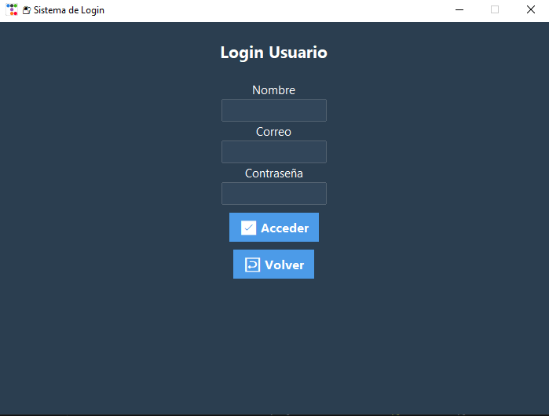
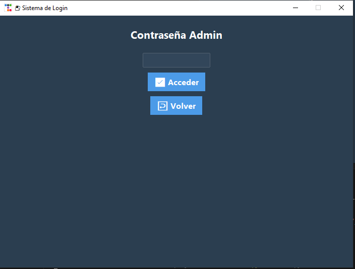
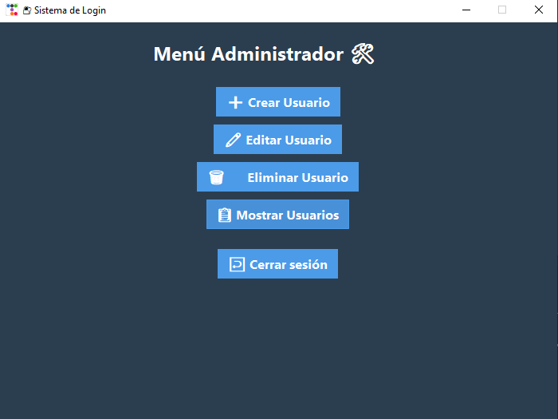

## Sistema de Gestión de Usuarios con Login
Este proyecto implementa un sistema de registro e inicio de sesión de usuarios utilizando Python, SQLite y bcrypt, con dos interfaces disponibles:
- Interfaz por consola: menú interactivo para registrar e iniciar sesión.
- Interfaz gráfica (GUI): construida con Tkinter/ttk, ofrece formularios modernos, botones estilizados y mensajes visuales.

## Características principales
 # Usuarios:
- Solo pueden iniciar sesión con sus credenciales.
- Acceso restringido: no pueden crear, editar ni eliminar cuentas.
 # Administrador:
- Login protegido con contraseña fija: (admin2006).
- Puede crear nuevos usuarios con validación de contraseña.
- Puede editar usuarios (nombre, correo y contraseña).
- Puede eliminar usuarios por ID.
- Puede mostrar todos los usuarios registrados en la interfaz.
 # Seguridad:
- Contraseñas encriptadas usando bcrypt.
- Validación de contraseñas: mínimo 8 caracteres, letras, números y símbolos.
 # Persistencia:
- Base de datos SQLite para almacenar usuarios.
 # Arquitectura modular:
- Separación clara entre lógica, base de datos e interfaces.
 # Dos modos de uso:
- Consola (menú interactivo).
- GUI (interfaz visual con estilo moderno).

## Estructura del proyecto
CONTRASEÑA/
core/ 
   - __init__.py                
   - base_usu.py        
   - Usuario.py         

data/                  
   - Usuarios.db        

Funciones/             
   - __init__.py
   - login.py 
   - validador.py          

Interfaz/              
   - __init__.py
   -  inter_consola.py   
   -  interfaz_Gui.py    

README.md              
requirements.txt       

## Clonar el repositorio:
git clone https://github.com/ElTomi006/CONTRASEÑA.git
cd CONTRASEÑA

## Instalar dependencias:
pip install -r requirements.txt

## Uso
- Ejecutar desde el archico (main.py)
Este archivo permite elegir entre la interfaz por consola o la interfaz gráfica, puede modificar según su elección. Ingrese este codigo en su terminal, para ejecutar el programa:  python main.py

- Ejecutar directamente por consola: python -m Interfaz.inter_consola

- Ejecutar directamente por intefaz: python -m Interfaz.interfaz_gui

## Dependencias
- Python 3.10+
- sqlite3 (incluido en Python)
- bcrypt
- tkinter/ttk

##  Capturas de pantalla

- Interfaz principal

- Inicio de sesión de usuario

- Acceso de Usuario

- Inicio sesion de administrador

    -> contraseña = admin2006

- Acceso del administrador

## Autor
- Leonardo Rojas
- rleo5923@gmail.com

